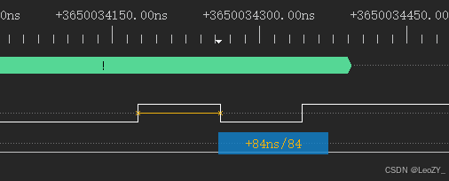
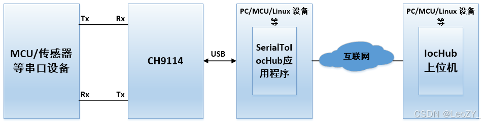

# SerialToIocHub

远程串口 - 串口数据与IocHub的透传(Remote serial port - transparent transmission of serial port data to IocHub)

# 前言

## 远程串口

串口通信由于结构简单在物联网等场景下被广泛运用，但受限于通讯距离较短，因此无法在远距离场景下应用，而远程串口通过网络可对传统串口进行拓展，使串口通讯不再受限于物理距离。
传统远程串口通过TCP通讯实现远程透传，但不同网段情况下是无法实现互通的。这时需要介绍一款可跨网段透传的程序来帮助我们实现真正意义上的远程串口。

## IocHub简介

IocHub(Internet of Chip Hub)为开发者提供了多平台的MCU接口联网透传开发库，该方案来自于南京沁恒微电子公司(WCH)，开发库包含Windows、Linux、MCU等多平台的的接口，实现了多平台跨网段的透传。**重点**：经向厂商咨询，该方案不涉及中间服务器，意味着透传数据安全得到保障！
IocHub库地址：[https://www.wch.cn/downloads/WCHIoCHubLib_MultiOS_ZIP.html](https://www.wch.cn/downloads/WCHIoCHubLib_MultiOS_ZIP.html)https://www.wch.cn/downloads/WCHIoCHubLib_MultiOS_ZIP.html)

## CH9114介绍

本次使用的USB转四路串口芯片CH9114，厂商驱动下该U串**连续通信最高波特率为15Mbps**，支持CDC免驱、24路GPIO输入输出等功能。



实际测试15Mbps波特率下，一位数据耗时84ns，很接近理论值。

芯片详情：

> [https://blog.csdn.net/qq_43010294/article/details/142853833](https://blog.csdn.net/qq_43010294/article/details/142853833)
> [https://www.wch.cn/products/CH9114.html](https://www.wch.cn/products/CH9114.html)

# 方案介绍

本文远程串口方案名为SerialToIocHub，顾名思义就是将串口数据与IocHub进行透传，实际应用场景有：
1、远程采集数据，如温湿度传感器数据通过SerialToIocHub传输至远程上位机，或借助CH9114的高波特率特点进行较大文件传输。
2、对远程电机等设备进行控制；
3、对远程设备进行控制，如远程调试交换机。

其中的IocHub上位机可使用IocHub库中的Demo程序，也可使用功能更加强大的TcpIpDebug网络调试工具：
[TcpIpDebug：https://www.wch.cn/downloads/TcpIpDebug_exe.html](https://www.wch.cn/downloads/TcpIpDebug_exe.html)
该上位机支持除了支持IocHub，还支持创建TCP服务器，自定义发送IP包等，是一款在网络开发中的调试利器。

# 使用方法及效果

首先使用-h参考下使用方法：

```bash
SerialToIoCHub.exe -h
  Usage:
 -h, --help                          display this message
 -c, --comname <COM num>             specify serial name, like:COM32
 -b, --baud <baud rate>              specify serial baud rate, default: 115200
 -d, --databit <date bit>            specify serial databit(5, 6, 7, 8), default: 8
 -s, --stopbit <stop bit>            specify serial stopbit(1, 1.5, 2), default: 1
 -v, --checkbit <check bit>          specify serial checkbit(N(None), O(Odd), E(Even), M(Mask), S(Space)), default: N
 -f, --flowctl <flow ctrl>           specify flow ctrl way(0(None), 1(RTS/CTS), 2(DTR/DSR), 3(XON/XOFF), default: 0)
 -i, --peerid <Peer ID>              specify the ID number of the iochub peer
 -ip, --ipaddress <local ip address> specify local NIC ip address
 -p, --peerpw <xxxxxxxx>             specify the password of the iochub peer
 -l, --list                          show all current serial ports and friendly names
```

例如要将CH9114（假设为COM4）实现远程串口，波特率设置为15000000，对端的IocHub的ID为7671A67F59F97732，那么命令为：

```bash
Example: SerialToIoCHub.exe -b 15000000 -i 7671A67F59F97732 -c COM4
```

```bash
指定对端id：SerialToIoCHub.exe -b 115200 -i 7671A67F59F97732 -c COM4
局域网自动搜索iochub设备并连接： SerialToIoCHub.exe -ip 192.168.50.2 -c COM15 -b 15000000
```